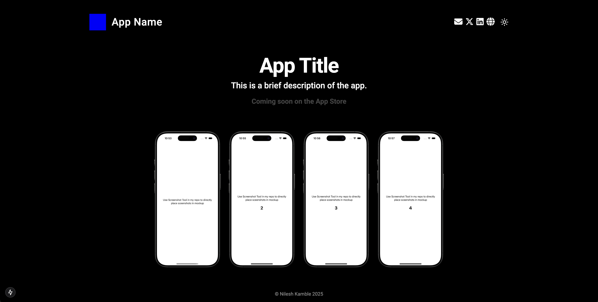

# Indie App Landing Page Template

A responsive and customizable landing page template built with Next.js, TypeScript, and Tailwind CSS, perfect for showcasing your new indie application.




## Features

- **Responsive Design**: Adapts to various screen sizes from mobile to desktop.
- **Dark/Light Mode**: Easy theme toggling for user preference.
- **Dynamic App Screenshots**: Displays a different number of screenshots based on screen size.
- **Customizable Content**: Easily update app name, title, description, and social links.
- **App Store Link**: Conditional display of "Download on the App Store" button or "Coming Soon" message.
- **Modern Tech Stack**: Built with Next.js, React, TypeScript, and Tailwind CSS.
- **Iconography**: Utilizes Lucide React, FontAwesome for clean and modern icons.

## Getting Started

These instructions will get you a copy of the project up and running on your local machine for development and testing purposes.

### Prerequisites

- Node.js (v18.x or later recommended)
- npm, yarn, or pnpm

### Installation

1.  **Clone the repository:**

    ```bash
    git clone https://github.com/TheIllustrator1972/IndieAppLandingPageTemplate.git
    cd IndieAppLandingPageTemplate
    ```

2.  **Install dependencies:**
    ```bash
    npm install
    ```

### Running the Development Server

```bash
npm run dev
```

Open http://localhost:3000 with your browser to see the result.

Technologies Used
Framework: Next.js
Language: TypeScript
UI Library: React
Styling: Tailwind CSS
Icons: Lucide React
Folder Structure
A brief overview of the key directories:

plaintext
IndieAppLandingPageTemplate/
├── app/
│ ├── common/ # Reusable UI components
│ │ ├── AppScreenshots.tsx
│ │ ├── AppTitleAndDescription.tsx
│ │ ├── Contact/
│ │ │ └── SocialIcons.tsx
│ │ ├── Download/
│ │ │ └── DownloadOnTheAppStore.tsx
│ │ ├── Header.tsx
│ │ ├── ThemeButton.tsx
│ │ └── constants.ts # App-specific data (name, description, etc.)
│ ├── layout.tsx # Main app layout
│ └── page.tsx # Main page component
├── public/
│ ├── AppLogo/
│ │ └── AppLogo.png
│ ├── AppScreenshots/
│ │ ├── 1.png
│ │ ├── 2.png
│ │ ├── 3.png
│ │ └── 4.png
│ └── ... # Other static assets
└── ... # Other project files (tailwind.config.js, next.config.js, etc.)
Customization

1. App Information
   Modify the appData object in /app/common/constants.ts to change:

App Name
App Title
App Description
Social Media Links
isLaunched status (to toggle between "Download" button and "Coming Soon" message)
Example app/common/constants.ts:

typescript
export const appData = {
name: "Your App Name",
title: "The Best App You'll Ever Use",
description: "An amazing description of your app's features and benefits.",
isLaunched: true, // Set to false for "Coming Soon",
socialLinks: {
twitter: "https://twitter.com/yourprofile",
github: "https://github.com/yourprofile",
// Add more social links as needed
},
// ... other app specific data
} 2. App Logo
Replace /public/AppLogo/AppLogo.png with your app's logo.

3. App Screenshots
   Replace the images in /public/AppScreenshots/ with your app's screenshots. The AppScreenshots.tsx component currently expects:

You can use the Screenshot Tool on my github to take screenshots sirectly from xcode simulator and place it in mockup

/AppScreenshots/1.png
/AppScreenshots/2.png
/AppScreenshots/3.png
/AppScreenshots/4.png
If you have a different number of screenshots or different naming, update the allScreenshots array in /app/common/AppScreenshots.tsx:

typescriptreact
// /app/common/AppScreenshots.tsx
const allScreenshots = [
"/AppScreenshots/1.png",
"/AppScreenshots/2.png",
// ... add or remove paths as needed
]; 4. Styling and Theme
Tailwind CSS: Customize styles directly in the component files using Tailwind utility classes.
Theme Colors: Colors for dark and light themes are defined using Tailwind's dark mode variant (e.g., dark:text-light-app-name-text). You can customize these in your tailwind.config.js or directly in the components.
text-dark-app-name-text
text-light-app-name-text
text-light-coming-soon-text
text-dark-coming-soon-text

```

```

# Things to change for every app

appName
description
download link
google analytics Id
